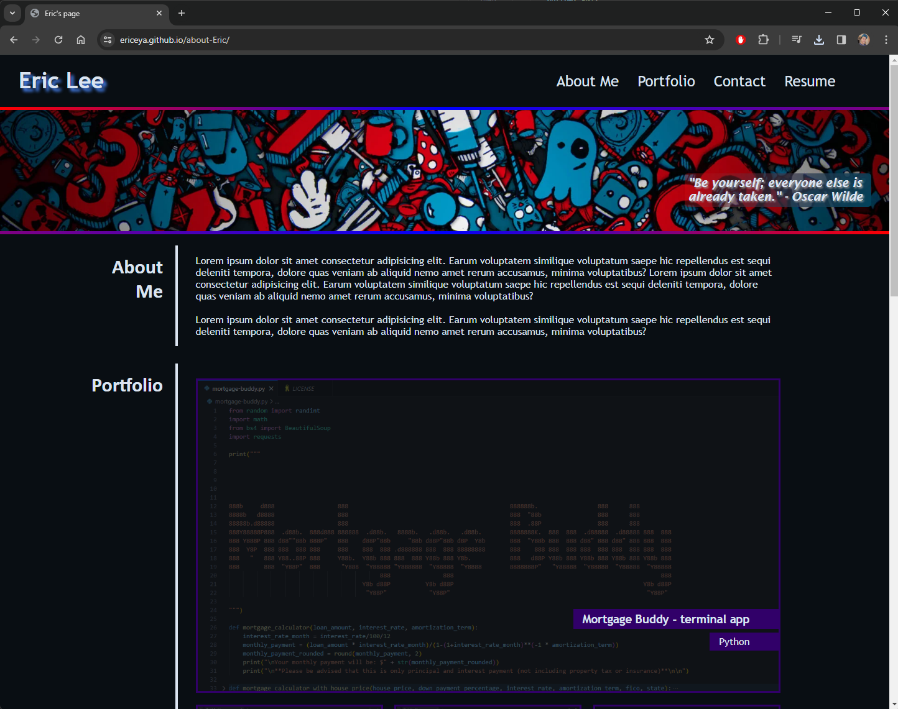
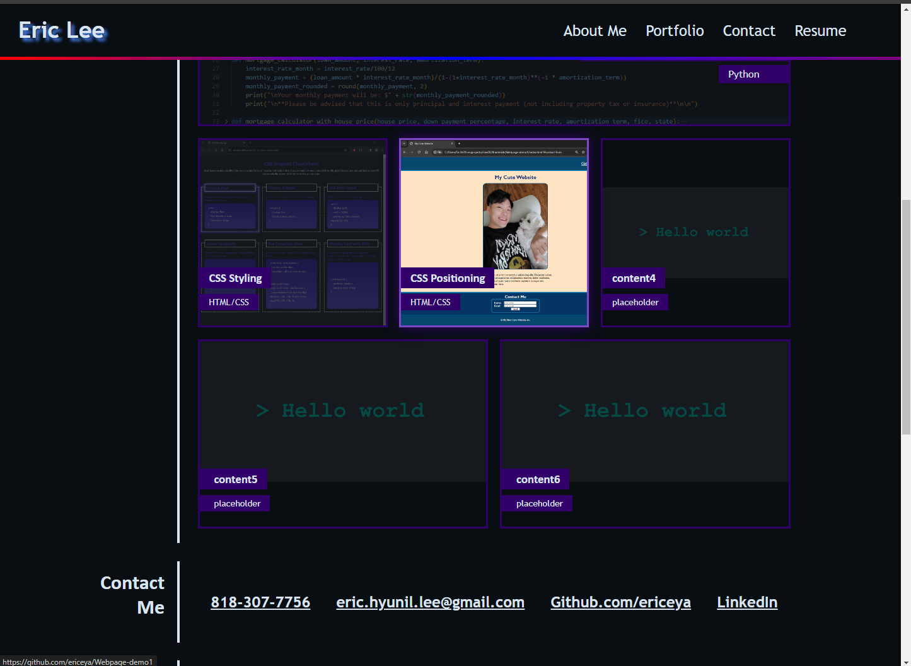
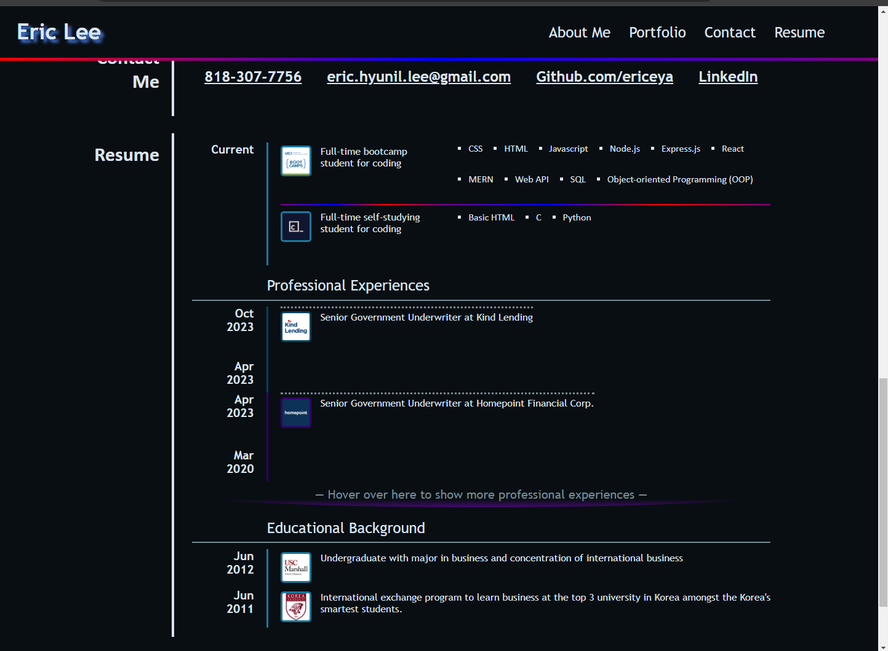
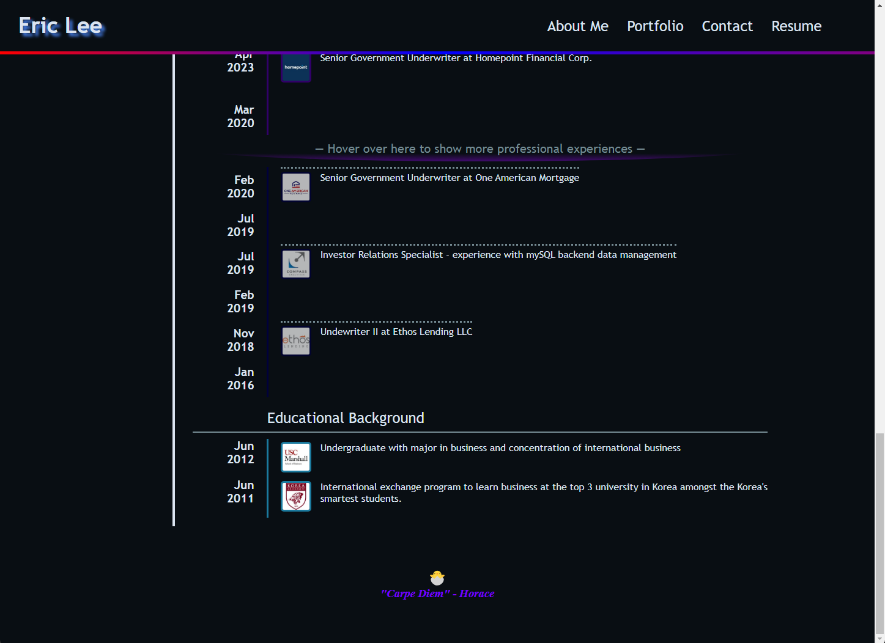

# About me

This repo is a little webpage about me and my path to engineering. As I learn new topics and features, they will be added to the portfolio throughout next 3 months.

## User Story

- AS A potential employee seeking employment
- I WANT to showcase my ability to design an architecture in a virtual webpage using HTML / CSS / Javascript
- SO THAT I can be an asset to any company looking for software engineer.

## Screenshot

## Link to deploy

[https://ericeya.github.io/about-Eric](https://ericeya.github.io/about-Eric)
